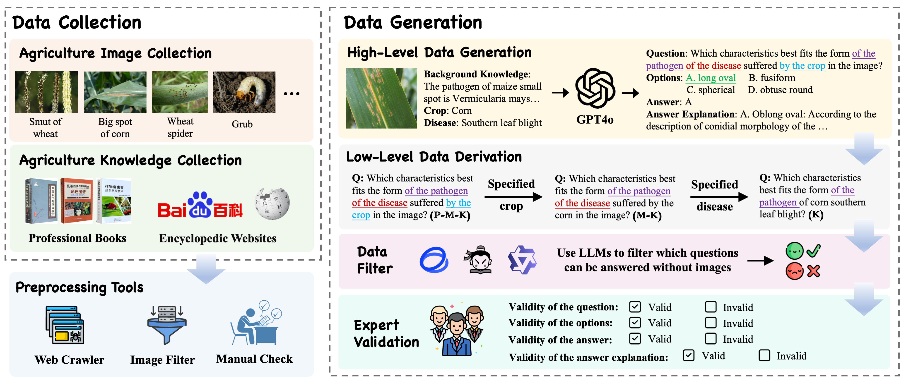
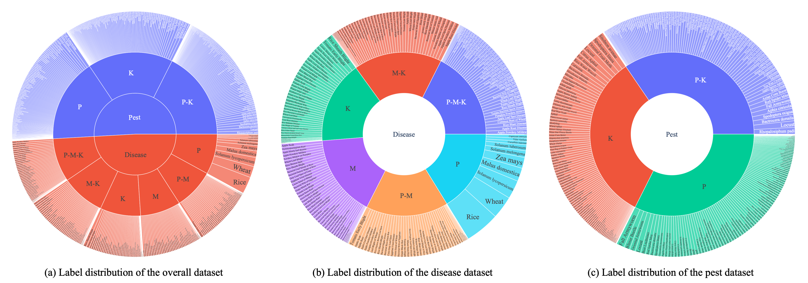
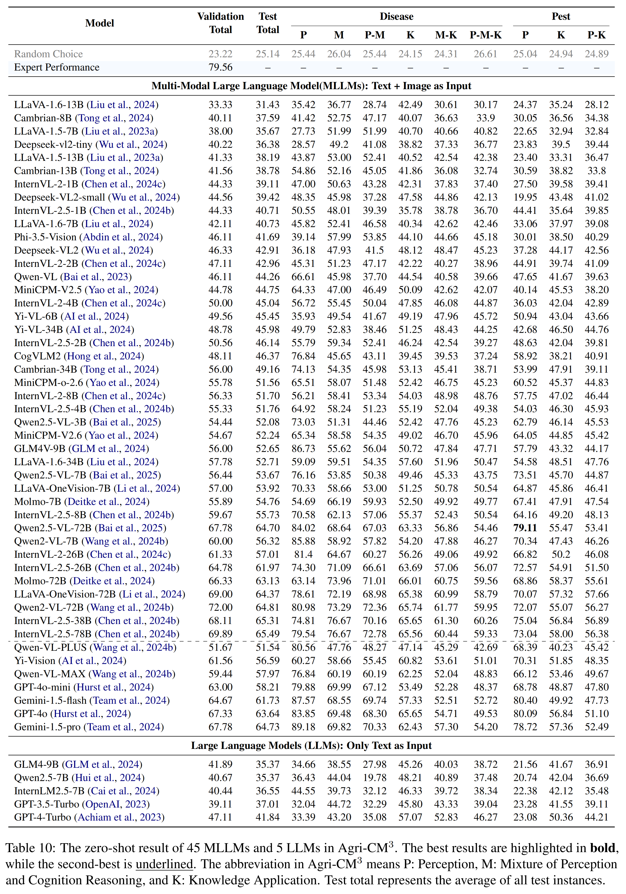

<div align="center">

# Agri-CM<sup>3</sup>: A Chinese Massive Multi-modal, Multi-level Benchmark for Agricultural Understanding and Reasoning

</div>

This is the repository containing evaluation datas, instructions and demonstrations with ***ACL 2025*** paper _**Agri-CM<sup>3</sup>: A Chinese Massive Multi-modal, Multi-level Benchmark for Agricultural Understanding and Reasoning**_ ([Wang et al., 2025]())

## Agri-CM<sup>3</sup> Benchmark

### Design Principal
Existing benchmarks often evaluate complex reasoning tasks as a whole, especially for tasks involving multiple reasoning steps, such as agricultural knowledge reasoning. This approach fails to accurately identify model strengths and weaknesses at each reasoning stage, leading to a lack of clear guidance for future model improvements.

To address this limitation, we propose Agri-CM<sup>3</sup>, which aims to comprehensively assess the complex reasoning capabilities of models in agricultural pest and disease management through a multi-level evaluation framework. We decompose the complex reasoning task into three key sub-tasks:

1. **Perception (P)**: The ability to identify crops and pests.
2. **Mixed Perception-Cognition Reasoning (M)**: The ability to identify crop symptoms and reason diseases.
3. **Knowledge Application (K)**: The ability to integrate and apply agricultural knowledge.

These key abilities are then combined into three levels based on task-specific needs:  

- **Level 1**: Evaluates model performance on a single sub-reasoning task.  
- **Level 2**: Assesses the model’s ability to perform a combination of two sub-reasoning tasks.  
- **Level 3**: Evaluates the model’s performance across the full reasoning chain.

Through this layered design, Agri-CM<sup>3</sup> provides a comprehensive evaluation of a model’s capabilities at different reasoning stages, offering detailed feedback on performance at each level. The overall data collection and generation process is illustrated in Figure 1.

### Construction Process

 

The overall process consists of two main stages: **Data Collection** and **Data Generation**.

📥 **1. Data Collection and Preprocessing**

- **Multi-source Integration**: Collected 21 public datasets covering 11 crops, 45 diseases, and 107 pests.
- **Knowledge Grounding**: Collected domain-specific agricultural knowledge from textbooks and authoritative encyclopedias to support question generation.
- **Image Filtering**:
  - Applied K-means clustering to remove highly similar images.
  - Filtered out low-resolution samples (final average resolution: 1800×1500).
- **Expert Curation**: Agricultural experts manually removed unusable or noisy images.

🧠 **2. Data Generation and Expert Validation**

- **High-Level QA Generation**: Created complex reasoning tasks (e.g., Disease-P-M-K, Pest-P-K) combining perception, mixed reasoning, and knowledge application.
- **Low-Level QA Derivation**: Derived simpler tasks by replacing/reducing entities in high-level questions to target specific reasoning stages.
- **Image Dependency Filtering**:
  - Used multiple LLMs to answer text-only questions.
  - Filtered out examples that were too easy for LLMs without visual input.
- **Expert Validation**:
  - Two agricultural experts annotated samples with explanations.
  - Inter-annotator agreement required ≥90% before formal labeling.

### Datasets Statistics


The Agri-CM<sup>3</sup> contains **3939** high-quality images and **15,901** multiple-choice questions across three reasoning levels, six disease tasks, and three pest tasks. 900 samples, 100 from each subclass, form the validation set, with the remaining 15,001 used for testing.

## Performance
we conduct a systematic evaluation of various MLLMs, including 38 open-source and seven proprietary models, to assess their performance on the Agri-CM<sup>3</sup> benchmark. All evaluations are conducted in a zero-shot setting.





<!-- ## Citation
If you find our work helpful, you can cite this paper as:

```bibtex
@misc{chu2023timebench,
      title={TimeBench: A Comprehensive Evaluation of Temporal Reasoning Abilities in Large Language Models}, 
      author={Zheng Chu and Jingchang Chen and Qianglong Chen and Weijiang Yu and Haotian Wang and Ming Liu and Bing Qin},
      year={2023},
      eprint={2311.17667},
      archivePrefix={arXiv},
      primaryClass={cs.CL},
      url={https://arxiv.org/abs/2311.17667}
}
``` -->